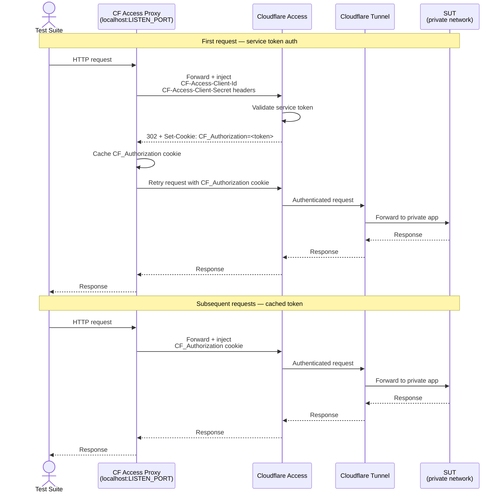

# cloudflare-access-proxy

## What?
This [GitHub Action](https://github.com/features/actions) allows CI/CD/CT pipelines to communicate with applications hosted on [Cloudflare Access](https://www.cloudflare.com/zero-trust/products/access/). Cloudflare Access can be used in conjunction with [Cloudflare Tunnels](https://developers.cloudflare.com/cloudflare-one/connections/connect-networks/) to _securely_ expose self-hosted applications over the public Internet.

## Why?
When testing complex enterprise applications, it's not always feasible \[or practical\] to containerize those applications into ephemeral testing environments. This leads many companies to reach for one of several workarounds:
- Using self-hosted runners to co-locate the Actions runner with internal infrastructure
- Using complex VPN, VPC, or peering configurations to allow traffic from Actions runners to reach the internal infrastructure
- Building and hosting custom CI/CD appliances with automation tools like Jenkins
- Other alternatives [here](https://docs.github.com/en/actions/using-github-hosted-runners/connecting-to-a-private-network)

These workarounds all share similar drawbacks:
- Additional expense
- Additional complexity
- Additional ongoing maintenance burden
- Increased security risk

With this plugin, your CI/CD/CT pipeline can use GitHub-hosted runners to communicate securely with internal infrastructure while accelerating your organization's adoption of Zero Trust/ZTNA practices and policies.

## How?
Calling this action will start a HTTP reverse proxy on the port defined by the `listen-port` parameter. Your CI/CD/CT pipeline can therefore be configured to send requests to `localhost`, and those requests will be forwarded to the Cloudflare Access application that you specify using the `target-url` parameter.

The proxy will inject the `CF-Access-Client-Id` and `CF-Access-Client-Secret` headers into the first request that gets forwarded. Upon successful authentication+authorization, the authorization token will be cached and used in subsequent requests.




### Example
```yaml
on:
  pull_request:
  push:
permissions:
  contents: read
jobs:
  build-test:
    name: Build & Test
    runs-on: ubuntu-latest
    env:
      CF_PROXY_PORT: 4600                           # set the port for the local proxy server
    steps:
      - uses: Voodoo262/cloudflare-access-proxy@v1  # start the proxy server
        with:
          cf-access-client-id: ${{ secrets.CF_ACCESS_CLIENT_ID }}
          cf-access-client-secret: ${{ secrets.CF_ACCESS_CLIENT_SECRET }}
          target-url: 'https://my-private-app-with-public-dns.my-domain.tld'
          listen-port: ${{ env.CF_PROXY_PORT }}
      - uses: actions/checkout@v4                   # checkout the app repo
      - run: npm ci                                 # install packages
      - env:
          SUT_URL: 'http://localhost:${{env.CF_PROXY_PORT}}/path/to/ui'
        run: npm test                               # run tests that communicate with self-hosted service
```

### Inputs
- `cf-access-client-id` - (required) Client ID of the service token
- `cf-access-client-secret` - (required) Client Secret of the service token
- `target-url` - (required) Public hostname of Cloudflare Access application
- `listen-port` - (optional) Port the reverse proxy will listen on (default: 8080)

### Prerequisites
1. A domain name configured to use Cloudflare DNS
2. A Cloudflare Tunnel running inside the network where the private, self-hosted application resides
3. A Cloudflare Access application that maps a public DNS name to your private, self-hosted application
4. A Service Auth token (which will provide the necessary values for `cf-access-client-id` and `cf-access-client-secret`)
5. A policy that grants your Service Auth token access to the Access application
